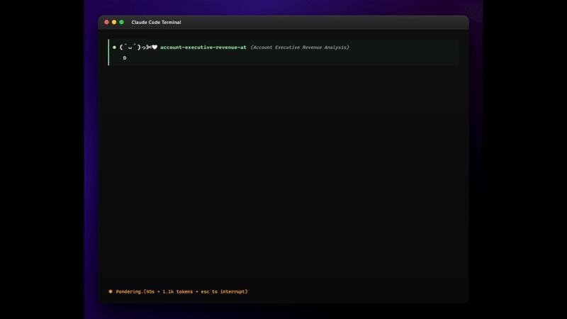

# 🎬 Claude Code Sub Agent Team Remotion Promo

<p align="center">
  
</p>

<div align="center">

[](https://www.typescriptlang.org/)
[](https://www.remotion.dev/)
[](https://reactjs.org/)

</div>

---

## 📖 About

A promotional animation showcasing Claude Code's sub agent team capabilities, inspired by [Greg Isenberg's tweet](https://x.com/gregisenberg/status/1949836925952508324) about AI agent teams and [Claude Log's writeup on humanising agents](https://claudelog.com/mechanics/humanising-agents/). This Remotion project demonstrates how multiple AI agents can collaborate sequentially on customer review analysis, each with their own personality and specialized role.

Built with **Remotion** and **TypeScript**, featuring a beautiful terminal interface with animated typing effects and creative ASCII text faces that bring each agent to life.

## ✨ What This Creates

This project generates a beautiful animated video featuring:

- 🖥️ **Terminal-style UI** with Mac-like window frame and traffic light buttons
- 🤖 **Sequential AI agents** processing customer review tasks
- ⌨️ **Animated typing effects** for realistic terminal feel
- 📊 **Dynamic counters** showing elapsed time and token usage
- 😄 **Creative ASCII text faces** for each agent personality (inspired by [Claude Log's humanising agents guide](https://claudelog.com/mechanics/humanising-agents/))
- 📜 **Smooth scrolling** to keep all content visible

## 🎭 Featured AI Agents

Each agent has a distinct personality through specialized roles and expressive text faces, following the humanization principles from [Claude Log's agent documentation](https://claudelog.com/mechanics/humanising-agents/):

| Agent                         | Text Face       | Role                                      |
| ----------------------------- | --------------- | ----------------------------------------- |
| **Account Executive Revenue** | `(＾◡＾)っ✂❤` | 💰 Revenue and business metrics           |
| **Customer Success**          | `(◍•ᴗ•◍)♡`      | 🤝 Customer relationship management       |
| **Product Engineering**       | `(╯°o°)ᕗ`       | ⚙️ Technical requirements and integration |
| **Managed Services**          | `ʕ•ᴥ•ʔ`         | 🛠️ Implementation health and performance  |
| **Customer Support**          | `¯\_(ツ)_/¯`    | 🎧 Support tickets and satisfaction       |

## 🎨 Visual Features

<table>
<tr>
<td width="50%">

### 🌈 Design Elements

- 🟣 **Purple gradient background** with radial highlights
- 🔘 **Rounded terminal frame** with realistic shadows
- 🎨 **Color-coded agents** with matching dots and borders
- ✨ **Animated dots** in pondering text (. .. ...)

</td>
<td width="50%">

### 🔧 Interactive Elements

- ⏱️ **Real-time counters** for seconds and tokens
- ☑️ **Sequential todo animations** with checkbox styling
- 📱 **Responsive design** with backdrop blur effects
- 🎯 **Smooth transitions** between agent tasks

</td>
</tr>
</table>

---

## 🚀 Quick Start

<details>
<summary>📦 <strong>Installation & Setup</strong></summary>

```bash
# Install dependencies
npm i

# Start development server
npm run dev
```

</details>

<details>
<summary>🎥 <strong>Rendering Options</strong></summary>

```bash
# Basic render
npx remotion render MyComposition out/video.mp4

# High quality render
npx remotion render MyComposition out/video.mp4 --codec=h264 --crf=18

# Custom resolution
npx remotion render MyComposition out/video.mp4 --width=1920 --height=1080
```

</details>

<details>
<summary>🔄 <strong>Updates</strong></summary>

```bash
# Upgrade Remotion
npx remotion upgrade
```

</details>

---

## ⚙️ Configuration

<div align="center">

| Setting           | Value                    |
| ----------------- | ------------------------ |
| 🕐 **Duration**   | 60 seconds (1800 frames) |
| 📐 **Resolution** | 1280x1024 (4:3 ratio)    |
| 🎬 **Frame Rate** | 30 fps                   |
| 📹 **Format**     | MP4 (H.264)              |

</div>

## 📁 Project Architecture

```
src/
├── 🎬 Composition.tsx      # Main composition with terminal UI
├── 🏠 Root.tsx            # Remotion root configuration
├── 📊 data.ts             # Agent data and todo items
└── 🧩 components/
    ├── 🎭 ReviewCard.tsx  # Individual agent card component
    ├── ✅ TodoList.tsx    # Animated todo list component
    └── ⌨️ Typer.tsx       # Typing animation component
```

## 🔧 Key Components

<table>
<tr>
<td>

### 🎬 `Composition.tsx`

- 🪟 Terminal window with title bar
- 🎨 Background gradient and styling
- 📜 Scroll animation system
- 💭 Dynamic pondering text

</td>
<td>

### 🎭 `ReviewCard.tsx`

- 👤 Agent information display
- 🌈 Color-coded styling
- 😄 Text face integration
- 📋 Status coordination

</td>
</tr>
<tr>
<td>

### ✅ `TodoList.tsx`

- 🔄 Sequential item animations
- ☑️ Checkbox styling with glow
- ⏱️ Realistic timing system
- 📝 Dynamic content rendering

</td>
<td>

### ⌨️ `Typer.tsx`

- 📝 Character-by-character animation
- ⚡ Configurable typing speed
- 🎯 Frame-based timing
- 🔄 Smooth text transitions

</td>
</tr>
</table>

---

## 🎨 Customization Guide

<details>
<summary>🤖 <strong>Adding New Agents</strong></summary>

Edit `src/data.ts` to add new agents:

```typescript
{
  color: '#FF6B6B',           // 🎨 Agent color theme
  name: 'new-agent-name',     // 🏷️ Agent identifier
  title: 'Agent Title',       // 📋 Display title
  status: 'Processing...',    // 📊 Current status
  textFace: '(◕‿◕)',         // 😄 ASCII personality
  todos: {                    // ✅ Task list
    items: [
      {text: 'Your todo item here'}
    ]
  }
}
```

</details>

<details>
<summary>⚡ <strong>Animation Timing</strong></summary>

Modify timing in `src/Composition.tsx`:

- ⏱️ `updateTodosTime`: Delay before todos appear
- 🔄 `todosTime`: Duration per todo item
- ⌨️ `typingSpeed`: Characters per frame in Typer

</details>

<details>
<summary>🎨 <strong>Visual Styling</strong></summary>

Update colors and gradients in the respective style objects:

- 🌈 Background gradients
- 🎨 Agent color schemes
- ✨ Shadow and blur effects

</details>

---

## 👨‍💻 Creator

<div align="center">

**Created by @chongdashu**

[](https://twitter.com/chongdashu)
[](https://youtube.com/@AIOriented)

</div>

## ☕ Support the Project

<div align="center">

If you find this codebase helpful in your AI development journey, consider buying me a coffee! ☕✨

<a href="https://buymeacoffee.com/aioriented" target="_blank">
  
</a>

</div>

---

## 📄 License

<div align="center">

**MIT License** 📜

_Feel free to use, modify, and distribute this project!_

</div>

---

<div align="center">

**Built with ❤️ using Remotion, TypeScript, and creative ASCII art**

⭐ _Don't forget to star this repo if you found it helpful!_ ⭐

</div>
